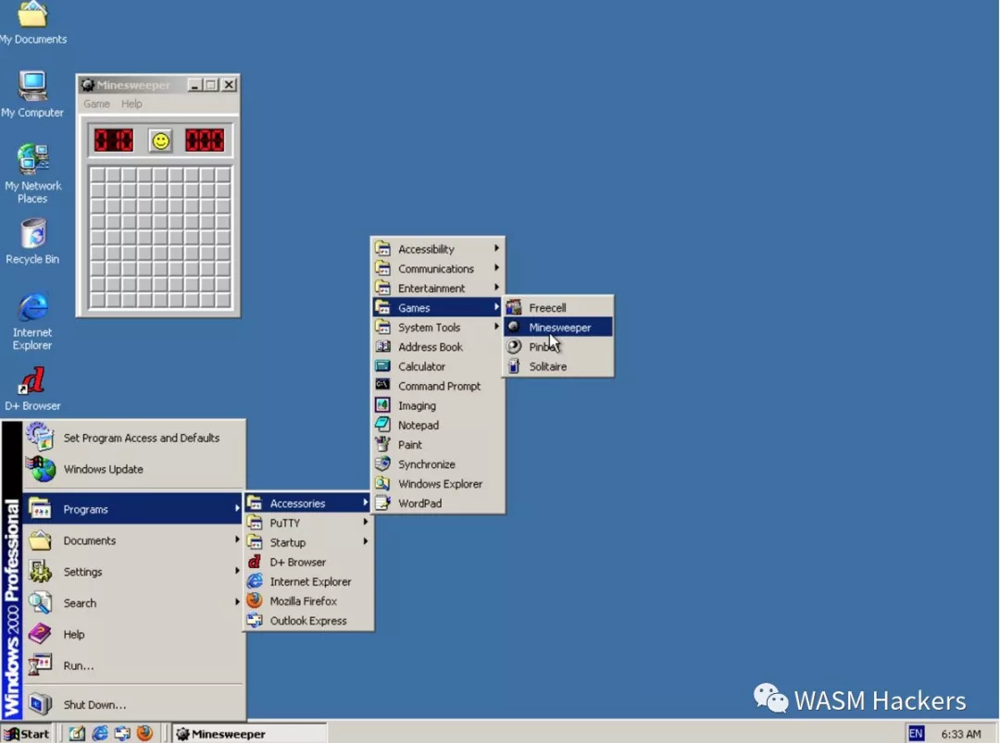

Go1.11已经正式发布，最大的一个亮点是增加了对WebAssembly的实验性支持。这也再一次验证了Ending定律的预言：所有可以编译到WebAssembly平台的软件终将会被编译到WebAssembly平台。

在上一周，qemu的作者bellard大神将Windows 2000搬到浏览器的新闻彻底引爆了WebAssembly技术，这也证明了WebAssembly的强大的性能优势。



感兴趣的同学可以查看bellard大神到网站，网站提供了在浏览器Linux和Windows等多种系统等运行链接：https://bellard.org/jslinux/

不过本文我们将重点和大家分享如何在Go语言中使用WebAssembly。先安装好Go1.11+版本的Go语言环境。然后创建hello.go文件：

```go
package main
import "fmt"

func main() {
    fmt.Println("你好，WebAssembly！")
}
```

为了不了解Go语言的同学便于理解，让我们简单介绍一下程序。第一句表示当前的包名字为main，同时包中有一个main函数，而main包的main函数就是Go语言程序的入口。在main函数中通过导入的fmt包内的Println方法输出了一个字符串。然后在命令行中直接输入go run hello.go来运行程序。如果一切正常的话。应该可以在命令行看到输出"你好，WebAssembly！"的结果。

Go1.11开始支持WebAssembly，对应的操作系统名为js，对应的CPU类型为wasm。目前还无法通过go run的方式直接运行输出的wasm文件，因此我们需要通过go build的方式生成wasm目标文件，然后通过Node环境执行。需要注意的是更新的Node版本对wasm的支持会更好，作者推进使用v10以上的版本。

通过以下命令将hello.go编译为a.out.wasm：

```
$ GOARCH=wasm GOOS=js go build -o a.out.wasm hello.go
```
生成的a.out.wasm文件体积可能超过2MB大小。而且生成等a.out.wasm还无法直接运行，需要初始化Go语言必须的运行时环境。

对运行时初始化是一个相对复杂的工作，因此Go语言提供了一个$(GOROOT)/misc/wasm/wasm_exec.js文件用于初始化和运行的工作。同时提供了一个基于node包装的$(GOROOT)/misc/wasm/go_js_wasm_exec脚本文件，用于执行Go语言生成的wasm文件。

参考go_js_wasm_exec脚本的实现，我们可以直接使用wasm_exec.js来运行wasm模块。我们可以先将wasm_exec.js文件复制到当前目录，然后通过以下命令运行wasm模块：

```
$ node wasm_exec.js a.out.wasm

你好，WebAssembly
```

现在终于可以正常运行Go语言生成wasm程序了。因此以后可以使用Go语言来开发Web应用了。

